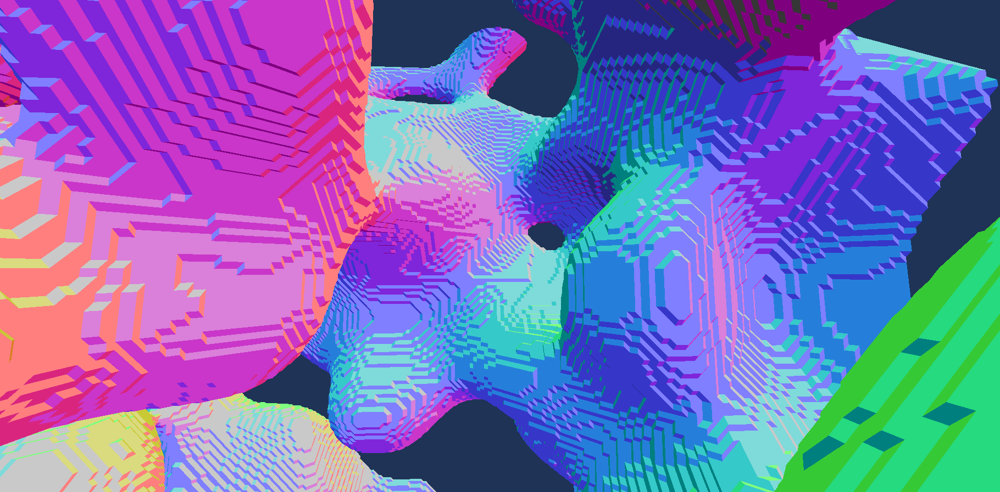

# OpenGL Marching Cubes

I've seen a few people do this project in proper game engines and I thought I could use OpenGL directly to display my mesh. I have no clue if this would actually be faster compared to Unity or Unreal, at least I don't have to deal with either of them.

The only library this program really requires is GLFW, that's `glfw-x11` or `glfw-wayland` on Arch Linux and I think `libglfw3-dev` on Ubuntu. I'm not sure when, or if I'm going to add Windows support, shouldn't be too hard since I used CMake but I don't have much of a clue. Same goes for MacOS.

As for running, each shader must be directly in the CWD in case you get any errors.

